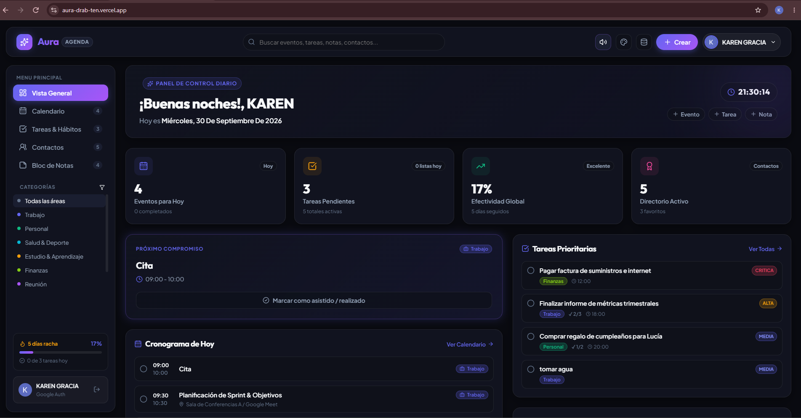
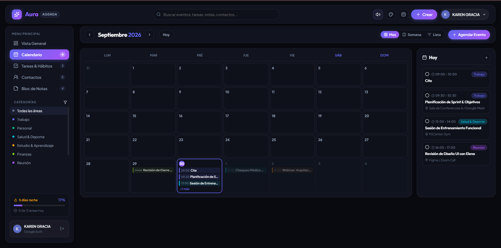
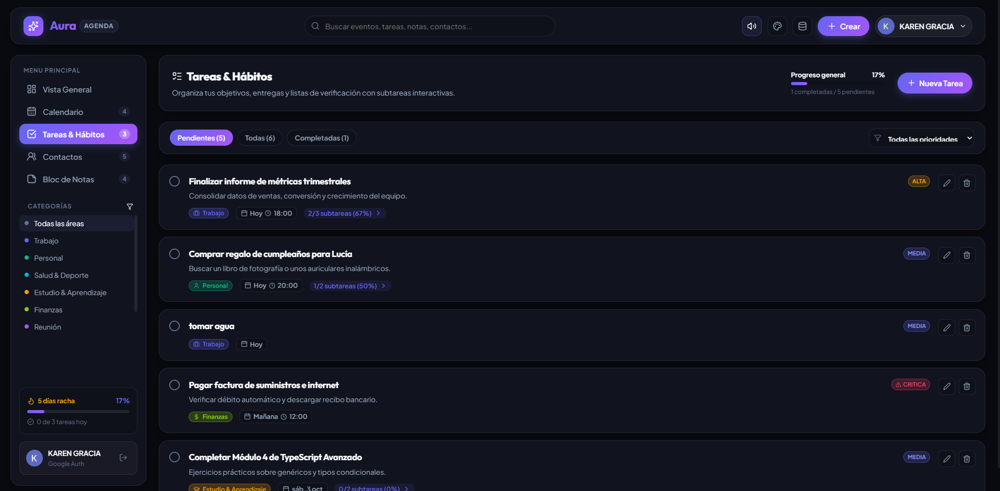
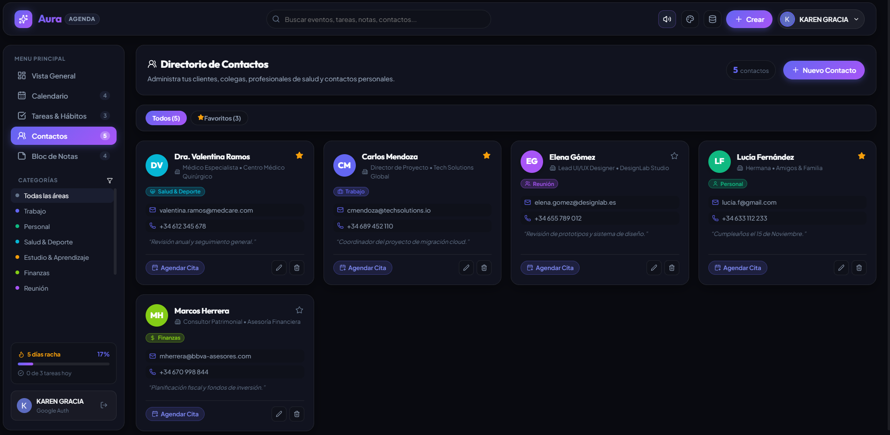
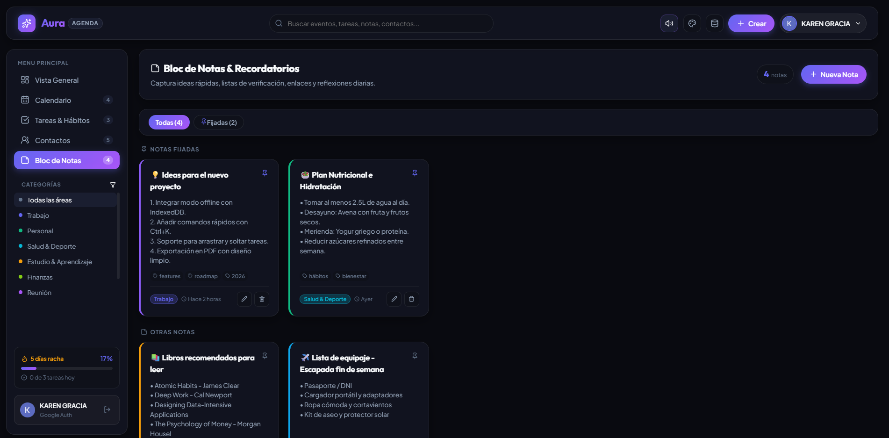

<div align="center">

# Aura Agenda

**Tu planificador inteligente: eventos, citas, tareas, hábitos, notas y contactos en un solo lugar.**

[](https://react.dev/)
[](https://www.typescriptlang.org/)
[](https://vitejs.dev/)
[](https://firebase.google.com/)
[](https://vitest.dev/)
[](https://vercel.com/)

[**Ver demo en producción →**](https://aura-drab-ten.vercel.app)

</div>

---

## Vista previa

<div align="center">
<video src="https://github.com/kdg13juan-web/Aura/blob/main/src/assets/Grabaci%C3%B3n%20de%20pantalla%202026-09-30%20212918.mp4" controls width="380"></video>
</div>







---

## Tabla de contenidos

- [Descripción general](#descripción-general)
- [Módulos](#módulos)
- [Stack tecnológico](#stack-tecnológico)
- [Estructura del proyecto](#estructura-del-proyecto)
- [Primeros pasos](#primeros-pasos)
- [Variables de entorno](#variables-de-entorno)
- [Scripts disponibles](#scripts-disponibles)
- [Testing](#testing)
- [Despliegue](#despliegue)
- [Licencia](#licencia)

---

## Descripción general

**Aura Agenda** es una aplicación web de planificación personal con un diseño moderno. Reúne en una sola interfaz el calendario, las tareas y hábitos, el directorio de contactos y un bloc de notas, e incluye estadísticas de productividad para visualizar el avance.

Está construida como *Single Page Application* con React y TypeScript, y desplegada en Vercel.

---

## Módulos

| Módulo | Descripción |
| --- | --- |
| **Home** | Panel principal con el resumen de la actividad y las estadísticas de productividad. |
| **Calendario** | Calendario interactivo para organizar eventos y citas. |
| **Tareas y hábitos** | Seguimiento de tareas pendientes y de hábitos recurrentes. |
| **Contactos** | Directorio de contactos. |
| **Bloc de notas** | Espacio para crear y consultar notas. |

---

## Stack tecnológico

| Capa | Tecnología |
| --- | --- |
| **Frontend** | React 19, TypeScript, Vite, React Router |
| **Interfaz** | Tabler Icons, Lucide, React Hot Toast, canvas-confetti |
| **Backend / datos** | Firebase (Firestore) |
| **Funciones serverless** | Vercel Functions (`api/`) |
| **Testing** | Vitest, React Testing Library |
| **Calidad de código** | Oxlint, ESLint, TypeScript |
| **Despliegue** | Vercel |

---

## Estructura del proyecto

```
.
├── api/               # Funciones serverless de Vercel
├── public/            # Recursos estáticos
├── src/
│   └── assets/        # Capturas y recursos multimedia del README
├── tests/             # Pruebas con Vitest
├── firestore.rules    # Reglas de seguridad de Firestore
├── vercel.json        # Configuración de despliegue
├── vite.config.ts
├── .env.example       # Plantilla de variables de entorno
└── package.json
```

---

## Primeros pasos

### Requisitos previos

- [Node.js](https://nodejs.org/) (versión LTS reciente) y npm
- Un proyecto de [Firebase](https://console.firebase.google.com/) con Firestore habilitado

### Instalación

```bash
# 1. Clonar el repositorio
git clone https://github.com/kdg13juan-web/Aura.git
cd Aura

# 2. Instalar dependencias
npm install

# 3. Configurar variables de entorno
cp .env.example .env
# Editar .env con las credenciales reales

# 4. Iniciar el servidor de desarrollo
npm run dev
```

Para probar localmente las funciones de `api/` junto con el frontend:

```bash
npx vercel dev
```

---

## Variables de entorno

Copia `.env.example` a `.env` y completa los valores reales. **Nunca subas `.env` al repositorio.**

- Las variables que debe leer el navegador (por ejemplo, la configuración de Firebase) **requieren el prefijo `VITE_`** para que Vite las exponga al cliente.
- Las credenciales usadas solo por el servidor (funciones de `api/`) **no deben llevar el prefijo `VITE_`**; de lo contrario quedarían incluidas en el bundle público.

---

## Scripts disponibles

| Script | Descripción |
| --- | --- |
| `npm run dev` | Servidor de desarrollo con recarga en caliente |
| `npm run build` | Comprobación de tipos (`tsc -b`) y build de producción |
| `npm run preview` | Sirve localmente el build de producción |
| `npm run lint` | Análisis estático con Oxlint |
| `npm run test` | Pruebas con Vitest en modo *watch* |
| `npm run test:run` | Ejecuta las pruebas una sola vez |

---

## Testing

Las pruebas se ejecutan con **Vitest** y **React Testing Library** (entorno `jsdom`) y viven en la carpeta `tests/`.

```bash
npm run test:run
```

---

## Despliegue

La aplicación está desplegada en **Vercel**: <https://aura-drab-ten.vercel.app>

1. Importa el repositorio en [Vercel](https://vercel.com/new).
2. Configura en **Settings → Environment Variables** las variables definidas en `.env.example`.
3. Despliega. Cada *push* a `main` genera un nuevo despliegue.
4. Publica las reglas de `firestore.rules` desde la consola de Firebase o con la CLI (`firebase deploy --only firestore:rules`).

---

## Licencia

Distribuido bajo licencia **MIT**. Consulta el archivo [`LICENSE`](LICENSE) para más información.
