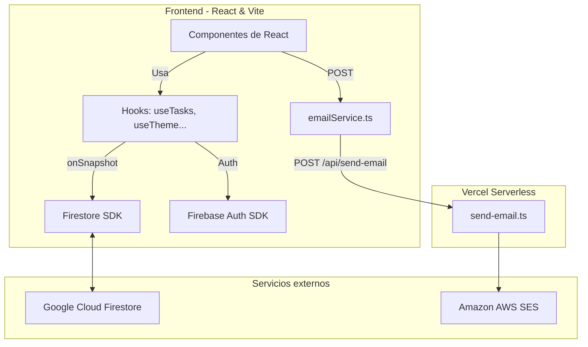

<<<<<<< HEAD
<div align="center">

# Aura

**Gestor de tareas full-stack con sincronización en tiempo real, temas personalizables y resúmenes por email.**

[](https://react.dev/)
[](https://www.typescriptlang.org/)
[](https://vitejs.dev/)
[](https://firebase.google.com/)
[](https://aws.amazon.com/ses/)
[](https://vitest.dev/)
[](https://vercel.com/)
[](#licencia)

[**Ver demo en producción →**](https://aura-drab-ten.vercel.app)

</div>

---

## Tabla de contenidos

- [Descripción general](#descripción-general)
- [Demo](#demo)
- [Funcionalidades](#funcionalidades)
- [Stack tecnológico](#stack-tecnológico)
- [Arquitectura](#arquitectura)
- [Estructura del proyecto](#estructura-del-proyecto)
- [Decisiones técnicas](#decisiones-técnicas)
- [Primeros pasos](#primeros-pasos)
- [Variables de entorno](#variables-de-entorno)
- [Scripts disponibles](#scripts-disponibles)
- [Flujo del email de resumen](#flujo-del-email-de-resumen)
- [Seguridad](#seguridad)
- [Testing](#testing)
- [Despliegue](#despliegue)
- [Desarrollo asistido por IA](#desarrollo-asistido-por-ia)
- [Licencia](#licencia)

---

## Descripción general

**Aura** es una *Single Page Application* para crear, organizar y dar seguimiento a tareas. Cada usuario cuenta con su propio espacio privado y puede asignar prioridades, fechas y horas de vencimiento y etiquetas, además de recibir por email un resumen de sus tareas agrupado por prioridad.

El proyecto prioriza tres aspectos:

- **Experiencia de usuario cuidada:** diseño *mobile-first*, tres temas visuales, *skeletons* sin saltos de layout, deshacer en el borrado y navegación completa por teclado.
- **Arquitectura mantenible:** componentes que solo describen la interfaz, lógica encapsulada en hooks y comunicación con servicios externos aislada en una capa propia.
- **Seguridad por diseño:** aislamiento de datos por usuario aplicado tanto en el cliente como en las reglas de Firestore.

---

## Demo

| | |
| --- | --- |
| **Producción** | <https://aura-drab-ten.vercel.app> |

<!--
  Agregar capturas y/o video del recorrido de la aplicación:
  
-->
[DEMO](C:\Users\kdgar\Desktop\Aura\src\assets\Grabación de pantalla 2026-09-30 212918.mp4)

<div align="center">
<video src=" " controls width="380"></video>
</div>


El recorrido cubre las pantallas de autenticación (inicio de sesión, registro y recuperación de contraseña) y el gestor de tareas en acción: filtros, creación, edición y eliminación, marcado como completada, guía de uso integrada y envío del resumen por email.

---

## Funcionalidades

### Autenticación y sesión
- Inicio de sesión y registro con **email y contraseña** o con **Google**.
- Recuperación de contraseña por email.
- Checklist de requisitos de contraseña en tiempo real.
- Sesión persistente y **rutas protegidas** (`ProtectedRoute` / `PublicOnlyRoute`).

### Gestión de tareas
- **CRUD completo** con los campos: título, descripción, prioridad (baja / media / alta), fecha y hora de vencimiento, y etiqueta.
- **Sincronización en tiempo real** con Firestore mediante `onSnapshot`.
- Descripciones largas expandibles con *Ver más / Ver menos*.
- Las tareas vencidas se resaltan siempre en rojo, independientemente de su prioridad.

### Borrado con deshacer
- **Deshacer individual** (5 s) al eliminar una tarea.
- **Deshacer masivo** (10 s) al eliminar todas las completadas.
- Ambos mediante un *toast* con acción "Deshacer".

### Búsqueda, filtros y orden
- Buscador en tiempo real por título, descripción y etiqueta, **insensible a acentos**.
- Filtros: todas / pendientes / completadas.
- Orden: recientes / prioridad / fecha de vencimiento.

### Personalización y UX
- Tres temas: **Clásico**, **Nocturno** y **Vívido**, persistidos en Firestore para sincronizarse entre dispositivos y aplicados sin parpadeo al cargar.
- Vista de **lista** y de **grilla** con alternancia.
- Botón de acción flotante (FAB) en móvil.
- *Skeletons* que respetan la vista activa (sin *layout shift*).
- *Toasts* en todas las acciones y navegación por teclado en los menús desplegables (flechas, Enter, Home/End).
- Dashboard con estadísticas y barra de progreso.
- Modal de instrucciones de uso.

### Resumen por email
- Email HTML *responsive* con las tareas agrupadas por prioridad.
- Color de acento acorde al tema elegido por el usuario.
- Envío mediante AWS SES a través de una función serverless de Vercel.

---

## Stack tecnológico

| Capa | Tecnología |
| --- | --- |
| **Frontend** | React 19, TypeScript, Vite, Tabler Icons |
| **Autenticación y base de datos** | Firebase Authentication, Cloud Firestore |
| **Email** | AWS SES mediante Vercel Serverless Function |
| **Estilos** | CSS puro con variables por tema (sin librerías de UI) |
| **Testing** | Vitest, React Testing Library |
| **Calidad de código** | ESLint, Oxlint, TypeScript estricto |
| **Despliegue** | Vercel (frontend + funciones serverless) |

---

## Arquitectura



### Separación de responsabilidades

Los componentes solo describen **qué se muestra**. La lógica de negocio vive en hooks (`useTasks`, `useTaskItem`, `useAuth`, `useTheme`) y la comunicación con servicios externos en `src/services/`. Esto permite probar cada capa de forma aislada y reemplazar proveedores sin tocar la interfaz.

---

## Estructura del proyecto

```
.
├── api/
│   └── send-email.ts        # Vercel Function: valida el payload, genera el HTML temático y llama a AWS SES
├── public/                  # Recursos estáticos
├── src/
│   ├── components/          # TodoForm, TaskEditForm, TaskCard, TaskGrid, TodoList, CustomSelect, Skeleton...
│   ├── hooks/               # useTasks (onSnapshot + CRUD), useAuth, useTheme, useTaskItem, useViewMode
│   ├── pages/               # Login, Register, ForgotPassword, Tasks
│   ├── routes/              # ProtectedRoute, PublicOnlyRoute
│   ├── services/            # firebase.ts (init), firestoreService.ts (CRUD), emailService.ts
│   ├── styles/              # tokens.css (variables por tema) + módulos CSS por sección
│   ├── types/               # Task, TaskFormValues, TaskFilter, TaskSort, Theme
│   └── utils/               # taskHelpers.ts, firebaseErrors.ts, format.ts, validate.ts
├── tests/                   # Suites de pruebas con Vitest
├── firestore.rules          # Reglas de seguridad de Firestore
├── vercel.json              # Configuración de despliegue
├── vite.config.ts
├── .env.example             # Plantilla de variables de entorno
└── package.json
```

---

## Decisiones técnicas

| Decisión | Motivo |
| --- | --- |
| **CSS puro con variables** | Permite tres temas sin dependencias. Se usa `data-theme` en `<html>` y `color-scheme` por tema para que los controles nativos (selectores de fecha y hora) respeten el modo claro/oscuro. |
| **`useLayoutEffect` para los temas** | Aplica `data-theme` antes del primer *paint* y evita el parpadeo de un tema incorrecto (FOUC). |
| **`onSnapshot` en lugar de `getDocs`** | Mantiene una suscripción persistente: cualquier cambio en Firestore se refleja en la UI sin recargar. |
| **`CustomSelect` en lugar de `<select>` nativo** | El `<select>` nativo ignora el CSS personalizado en la mayoría de sistemas operativos. `CustomSelect` implementa un *listbox* ARIA completo con navegación por teclado. |
| **Función de email autónoma** | Con `"type": "module"` en `package.json`, Node.js exige extensiones `.js` en los imports locales al compilar TypeScript. Mantener la función en un único archivo evita problemas de resolución de módulos en Vercel. |
| **Patrón de deshacer en el borrado** | El borrado en Firestore es inmediato e irreversible. La tarea desaparece de la UI al instante, pero se elimina de Firestore tras 5 s (10 s en borrado masivo); un `Map<taskId, timerId>` gestiona las cancelaciones pendientes. |
| **Doble capa de seguridad** | El cliente filtra con `where('userId', '==', uid)` y las reglas de Firestore validan `request.auth.uid == resource.data.userId`. Aunque alguien manipule el cliente, Firestore rechaza la operación. |

---

## Primeros pasos

### Requisitos previos

- [Node.js](https://nodejs.org/) (versión LTS reciente) y npm
- Un proyecto de [Firebase](https://console.firebase.google.com/) con **Authentication** (email/contraseña y Google) y **Firestore** habilitados
- *(Opcional)* Una cuenta de AWS con **SES** configurado, para probar el envío de emails

### Instalación

```bash
# 1. Clonar el repositorio
git clone https://github.com/kdg13juan-web/Aura.git
cd Aura

# 2. Instalar dependencias
npm install

# 3. Configurar variables de entorno
cp .env.example .env
# Editar .env con las credenciales reales

# 4. Iniciar el servidor de desarrollo
npm run dev
```

Para probar localmente la función serverless de email junto con el frontend:

```bash
npx vercel dev
```

---

## Variables de entorno

Copiar `.env.example` a `.env` y completar con los valores reales. **Nunca subir `.env` al repositorio.**

```bash
# Firebase — el prefijo VITE_ es obligatorio para que Vite las exponga al cliente
VITE_FIREBASE_API_KEY=
VITE_FIREBASE_AUTH_DOMAIN=
VITE_FIREBASE_PROJECT_ID=
VITE_FIREBASE_STORAGE_BUCKET=
VITE_FIREBASE_MESSAGING_SENDER_ID=
VITE_FIREBASE_APP_ID=

# AWS SES — SIN prefijo VITE_: solo las usa el servidor (Vercel Function)
AWS_ACCESS_KEY_ID=
AWS_SECRET_ACCESS_KEY=
AWS_REGION=
SES_FROM_EMAIL=

# URL pública de la app (usada en el email de resumen)
APP_URL=https://aura-drab-ten.vercel.app
```

> [!IMPORTANT]
> Las variables de AWS **no** deben llevar el prefijo `VITE_`. De lo contrario, Vite las incluiría en el bundle del cliente y quedarían expuestas públicamente.

> [!NOTE]
> **AWS SES en modo *sandbox*:** el email solo se entrega a direcciones verificadas manualmente en la consola de AWS. Para uso en producción real es necesario solicitar acceso productivo a AWS.

---

## Scripts disponibles

| Script | Descripción |
| --- | --- |
| `npm run dev` | Inicia el servidor de desarrollo con recarga en caliente |
| `npm run build` | Genera el build de producción |
| `npm run test` | Ejecuta la suite de pruebas con Vitest |
| `npm run lint` | Analiza el código con ESLint |

---

## Flujo del email de resumen

1. El usuario hace clic en **Enviar resumen** y `Tasks.tsx` invoca `sendTaskSummary(email, tasks, { name, theme })`.
2. `emailService.ts` formatea las fechas en la zona horaria local del usuario (el servidor corre en UTC) y realiza un `POST /api/send-email`.
3. La función de Vercel valida el payload y asigna un color de acento según el tema:

   | Tema | Color de acento |
   | --- | --- |
   | `classic` | `#4F6EF7` |
   | `midnight` | `#5c7cfa` |
   | `gradient` | `#7c3aed` |

4. Se genera un HTML con las tareas agrupadas en una grilla de 2 columnas (tablas anidadas para máxima compatibilidad con clientes de email) y se envía mediante AWS SES en versiones HTML y texto plano.

> [!NOTE]
> La funcionalidad está implementada y operativa. Mientras AWS SES permanezca en *sandbox*, el envío solo funciona hacia direcciones verificadas; la restricción pertenece al entorno de pruebas, no al código.

---

## Seguridad

Los datos de cada usuario están aislados mediante dos capas complementarias:

1. **Cliente:** las consultas filtran siempre por `userId` (`where('userId', '==', uid)`).
2. **Servidor:** las reglas de Firestore rechazan cualquier lectura o escritura que no pertenezca al usuario autenticado, e impiden reasignar la propiedad de una tarea.

```js
rules_version = '2';
service cloud.firestore {
  match /databases/{database}/documents {
    match /tasks/{taskId} {
      allow read: if request.auth != null
        && request.auth.uid == resource.data.userId;
      allow create: if request.auth != null
        && request.auth.uid == request.resource.data.userId;
      allow update: if request.auth != null
        && request.auth.uid == resource.data.userId
        && request.resource.data.userId == resource.data.userId;
      allow delete: if request.auth != null
        && request.auth.uid == resource.data.userId;
    }
    match /users/{uid} {
      allow read, write: if request.auth != null && request.auth.uid == uid;
    }
  }
}
```

Buenas prácticas adicionales:

- Las credenciales de AWS solo existen en el servidor y nunca se exponen al cliente.
- `.env` está excluido del control de versiones; `.env.example` documenta la configuración necesaria.

---

## Testing

**24 pruebas en 5 archivos.** Ejecutar con:

```bash
npm run test
```

| Archivo | Cobertura |
| --- | --- |
| `firebaseErrors.test.ts` | Mapeo de códigos de error de Firebase a mensajes legibles. Función pura, sin mocks. |
| `emailService.test.ts` | Construcción del payload, formateo de fechas en zona local y manejo de errores de la función serverless. |
| `taskHelpers.test.ts` | Filtrado y ordenamiento de tareas. |
| `TodoForm.test.tsx` | Validación, envío y manejo de errores del formulario. Firebase mockeado. |
| `TodoList.test.tsx` | Renderizado de la lista y sus acciones. Firebase mockeado. |

---

## Despliegue

La aplicación se despliega en **Vercel**, que sirve el frontend estático y ejecuta la función `api/send-email.ts` como *serverless function*.

1. Importar el repositorio en [Vercel](https://vercel.com/new).
2. Configurar en **Settings → Environment Variables** todas las variables descritas en [Variables de entorno](#variables-de-entorno).
3. Desplegar. Cada *push* a la rama `main` genera un nuevo despliegue automáticamente.
4. Publicar las reglas de `firestore.rules` desde la consola de Firebase o con la CLI (`firebase deploy --only firestore:rules`).
5. Agregar el dominio de producción en **Firebase Authentication → Settings → Authorized domains** para que el inicio de sesión con Google funcione.

---

## Desarrollo asistido por IA

El proyecto se desarrolló con Claude como copiloto de desarrollo, que asistió en el diagnóstico de CSS, la validación de patrones de React y la generación de casos de prueba. Las decisiones de arquitectura, producto y tecnología fueron propias.

| Decisiones de producto y arquitectura (autoría propia) | Ejecución y validación (asistida por el modelo) |
| --- | --- |
| CSS puro con variables en lugar de Tailwind | Diagnóstico de colisiones de especificidad CSS |
| Hooks personalizados para separar lógica de UI | Validación del comportamiento de `useLayoutEffect` frente a `useEffect` |
| Persistencia multidispositivo de temas en Firestore | Hipótesis de error en los tests de fechas UTC frente a local |
| Reglas de seguridad de Firestore por UID | Identificación de casos límite en el flujo de `onSnapshot` |
| Descarte del asistente conversacional | Refactors de componentes y módulos CSS |

**Metodología de trabajo**

- **Entender antes de implementar:** se solicitaba la explicación del patrón subyacente antes de escribir código.
- **Alternativas con sus *trade-offs*:** ante varias soluciones posibles, se evaluaban las opciones y se decidía según el contexto.
- **Revisión línea por línea:** ningún fragmento entraba al proyecto sin poder explicar qué hace y por qué.
- **Iteración hasta alcanzar el nivel de calidad esperado:** varias funcionalidades se implementaron, descartaron y rehicieron porque el resultado no estaba a la altura del resto de la aplicación.

**Decisión de alcance: asistente de IA descartado.** Se implementó un asistente conversacional sobre la API de Gemini (con función serverless, proxy y *system prompt* funcionando). Tras evaluarlo, se descartó deliberadamente: añadía complejidad, dependía de una API key adicional y su valor para el usuario no justificaba el costo. Se priorizó contar con menos funcionalidades bien ejecutadas.
